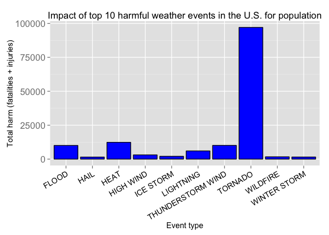
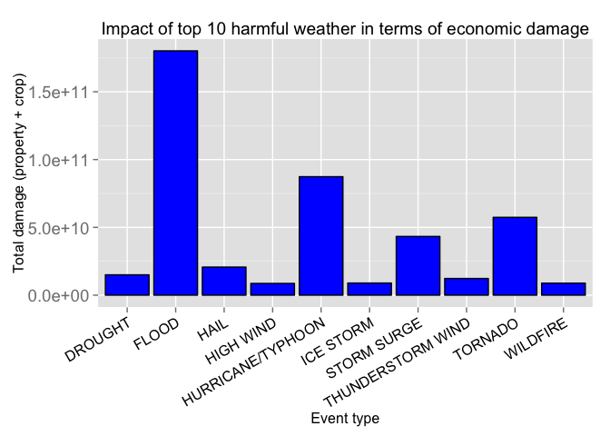

# Reproducable Research (A2): Analysis of the consequences of major storms and weather events in the U.S. for population and economy
**authored by [benwol](https://github.com/BenWol/RepData_PeerAssessment1)**

Synopsis
------------
The goal of this analysis is to explore the NOAA Storm Database after which weather phenomena have the most severe consequences for the U.S. population as well as for the economy. Storms and other severe weather events can cause both public health and economic problems for communities and municipalities. Many severe events can result in fatalities, injuries, and property damage, and preventing such outcomes to the extent possible is a key concern. This project involves exploring the U.S. National Oceanic and Atmospheric Administration's (NOAA) storm database. This database tracks characteristics of major storms and weather events in the United States, including when and where they occur, as well as estimates of any fatalities, injuries, and property damage. In particular we want to answer the questions:

1. Across the United States, which types of events are most harmful with respect to population health?
2. Across the United States, which types of events have the greatest economic consequences?

## Data Processing
Before analyzing the data to answer the two main questions, the structure of the data set needs to be evaluated and tydied in order to be able to extract the data of interest.

### (Down-)Loading the data
At first the data set is downloaded and read into the workspace.
The code checks if the data is already present in the current working directory and skips the download if that is true.


```r
if(!file.exists("repdata-data-StormData.csv.bz2")){
  url <- "https://d396qusza40orc.cloudfront.net/repdata%2Fdata%2FStormData.csv.bz2"
  download.file(url,destfile = "repdata-data-StormData.csv.bz2",method = "curl")
}
```
The read.csv function automatically handles bz2-compressed data, so no need for an extra unzip step.

```r
storm_raw <- read.csv("repdata-data-StormData.csv.bz2")
```
The data set contains 902297 observations (rows) and includes 37 variables (colums). The different variable names are:

```r
names(storm_raw)
```

```
##  [1] "STATE__"    "BGN_DATE"   "BGN_TIME"   "TIME_ZONE"  "COUNTY"    
##  [6] "COUNTYNAME" "STATE"      "EVTYPE"     "BGN_RANGE"  "BGN_AZI"   
## [11] "BGN_LOCATI" "END_DATE"   "END_TIME"   "COUNTY_END" "COUNTYENDN"
## [16] "END_RANGE"  "END_AZI"    "END_LOCATI" "LENGTH"     "WIDTH"     
## [21] "F"          "MAG"        "FATALITIES" "INJURIES"   "PROPDMG"   
## [26] "PROPDMGEXP" "CROPDMG"    "CROPDMGEXP" "WFO"        "STATEOFFIC"
## [31] "ZONENAMES"  "LATITUDE"   "LONGITUDE"  "LATITUDE_E" "LONGITUDE_"
## [36] "REMARKS"    "REFNUM"
```
To get an idea about the data set, the first 10 observables are plotted here:

```r
head(storm_raw,10)
```

```
##    STATE__           BGN_DATE BGN_TIME TIME_ZONE COUNTY COUNTYNAME STATE
## 1        1  4/18/1950 0:00:00     0130       CST     97     MOBILE    AL
## 2        1  4/18/1950 0:00:00     0145       CST      3    BALDWIN    AL
## 3        1  2/20/1951 0:00:00     1600       CST     57    FAYETTE    AL
## 4        1   6/8/1951 0:00:00     0900       CST     89    MADISON    AL
## 5        1 11/15/1951 0:00:00     1500       CST     43    CULLMAN    AL
## 6        1 11/15/1951 0:00:00     2000       CST     77 LAUDERDALE    AL
## 7        1 11/16/1951 0:00:00     0100       CST      9     BLOUNT    AL
## 8        1  1/22/1952 0:00:00     0900       CST    123 TALLAPOOSA    AL
## 9        1  2/13/1952 0:00:00     2000       CST    125 TUSCALOOSA    AL
## 10       1  2/13/1952 0:00:00     2000       CST     57    FAYETTE    AL
##     EVTYPE BGN_RANGE BGN_AZI BGN_LOCATI END_DATE END_TIME COUNTY_END
## 1  TORNADO         0                                               0
## 2  TORNADO         0                                               0
## 3  TORNADO         0                                               0
## 4  TORNADO         0                                               0
## 5  TORNADO         0                                               0
## 6  TORNADO         0                                               0
## 7  TORNADO         0                                               0
## 8  TORNADO         0                                               0
## 9  TORNADO         0                                               0
## 10 TORNADO         0                                               0
##    COUNTYENDN END_RANGE END_AZI END_LOCATI LENGTH WIDTH F MAG FATALITIES
## 1          NA         0                      14.0   100 3   0          0
## 2          NA         0                       2.0   150 2   0          0
## 3          NA         0                       0.1   123 2   0          0
## 4          NA         0                       0.0   100 2   0          0
## 5          NA         0                       0.0   150 2   0          0
## 6          NA         0                       1.5   177 2   0          0
## 7          NA         0                       1.5    33 2   0          0
## 8          NA         0                       0.0    33 1   0          0
## 9          NA         0                       3.3   100 3   0          1
## 10         NA         0                       2.3   100 3   0          0
##    INJURIES PROPDMG PROPDMGEXP CROPDMG CROPDMGEXP WFO STATEOFFIC ZONENAMES
## 1        15    25.0          K       0                                    
## 2         0     2.5          K       0                                    
## 3         2    25.0          K       0                                    
## 4         2     2.5          K       0                                    
## 5         2     2.5          K       0                                    
## 6         6     2.5          K       0                                    
## 7         1     2.5          K       0                                    
## 8         0     2.5          K       0                                    
## 9        14    25.0          K       0                                    
## 10        0    25.0          K       0                                    
##    LATITUDE LONGITUDE LATITUDE_E LONGITUDE_ REMARKS REFNUM
## 1      3040      8812       3051       8806              1
## 2      3042      8755          0          0              2
## 3      3340      8742          0          0              3
## 4      3458      8626          0          0              4
## 5      3412      8642          0          0              5
## 6      3450      8748          0          0              6
## 7      3405      8631          0          0              7
## 8      3255      8558          0          0              8
## 9      3334      8740       3336       8738              9
## 10     3336      8738       3337       8737             10
```
Since the data is quite messy and mixed up with different not really usable entries, we have to carefully go through the single variables and observations.
### Preprocessing the data - 1. What variables are important to our analysis?
In order to answer the questions of how strongly the different weather conditions ("EVTYPE") influenced fatalities ("FATALITIES") and injuries ("INJURIES") on the population as well the economic damage ("PROPDMG","PROPDMGEXP","CROPDMG","PROPDMGEXP") across the U.S. ("STATE__"), the data set can be narrowed down to the main variables:

```r
storm <- storm_raw[,c("STATE__","EVTYPE","FATALITIES","INJURIES","PROPDMG","PROPDMGEXP","CROPDMG","CROPDMGEXP")]
head(storm,10)
```

```
##    STATE__  EVTYPE FATALITIES INJURIES PROPDMG PROPDMGEXP CROPDMG
## 1        1 TORNADO          0       15    25.0          K       0
## 2        1 TORNADO          0        0     2.5          K       0
## 3        1 TORNADO          0        2    25.0          K       0
## 4        1 TORNADO          0        2     2.5          K       0
## 5        1 TORNADO          0        2     2.5          K       0
## 6        1 TORNADO          0        6     2.5          K       0
## 7        1 TORNADO          0        1     2.5          K       0
## 8        1 TORNADO          0        0     2.5          K       0
## 9        1 TORNADO          1       14    25.0          K       0
## 10       1 TORNADO          0        0    25.0          K       0
##    CROPDMGEXP
## 1            
## 2            
## 3            
## 4            
## 5            
## 6            
## 7            
## 8            
## 9            
## 10
```
### Preprocessing the data - 2. Subsetting the data after entries from U.S. states (and not outlying areas)
At first we take a look at the "STATE__" variable to see what entries are existing:

```r
sort(unique(storm$STATE__))
```

```
##  [1]  1  2  4  5  6  8  9 10 11 12 13 15 16 17 18 19 20 21 22 23 24 25 26
## [24] 27 28 29 30 31 32 33 34 35 36 37 38 39 40 41 42 44 45 46 47 48 49 50
## [47] 51 53 54 55 56 60 66 68 72 78 81 83 84 85 86 87 88 89 90 91 92 93 94
## [70] 95
```
As one can see there are 70 different states included in the data set. According to the [American National Standards Institude (ANSI)](https://www.census.gov/geo/reference/ansi_statetables.html), official states and the district of Columbia (excluding the outlying areas, freely associated states, and the individual minor outlying island territories) only correspond to the FIPS State Numeric Code between 01 and 56. In the following we subset the dataset for only those main US states:

```r
storm_us <- storm[storm$STATE__ >= 1 & storm$STATE__ <= 56,]
```
Of course this step can also be left out, if you want to include all outlying U.S. islands and teritories!!!
### Preprocessing the data - 3. Cleaning up the types of weather events ('EVTYPE')
There are 985 weather events listed in the dataset from:

```r
head(levels(storm_us$EVTYPE),25)
```

```
##  [1] "   HIGH SURF ADVISORY"       " COASTAL FLOOD"             
##  [3] " FLASH FLOOD"                " LIGHTNING"                 
##  [5] " TSTM WIND"                  " TSTM WIND (G45)"           
##  [7] " WATERSPOUT"                 " WIND"                      
##  [9] "?"                           "ABNORMAL WARMTH"            
## [11] "ABNORMALLY DRY"              "ABNORMALLY WET"             
## [13] "ACCUMULATED SNOWFALL"        "AGRICULTURAL FREEZE"        
## [15] "APACHE COUNTY"               "ASTRONOMICAL HIGH TIDE"     
## [17] "ASTRONOMICAL LOW TIDE"       "AVALANCE"                   
## [19] "AVALANCHE"                   "BEACH EROSIN"               
## [21] "Beach Erosion"               "BEACH EROSION"              
## [23] "BEACH EROSION/COASTAL FLOOD" "BEACH FLOOD"                
## [25] "BELOW NORMAL PRECIPITATION"
```
to

```r
tail(levels(storm_us$EVTYPE),25)
```

```
##  [1] "WIND ADVISORY"           "WIND AND WAVE"          
##  [3] "WIND CHILL"              "WIND CHILL/HIGH WIND"   
##  [5] "Wind Damage"             "WIND DAMAGE"            
##  [7] "WIND GUSTS"              "WIND STORM"             
##  [9] "WIND/HAIL"               "WINDS"                  
## [11] "WINTER MIX"              "WINTER STORM"           
## [13] "WINTER STORM HIGH WINDS" "WINTER STORM/HIGH WIND" 
## [15] "WINTER STORM/HIGH WINDS" "WINTER STORMS"          
## [17] "Winter Weather"          "WINTER WEATHER"         
## [19] "WINTER WEATHER MIX"      "WINTER WEATHER/MIX"     
## [21] "WINTERY MIX"             "Wintry mix"             
## [23] "Wintry Mix"              "WINTRY MIX"             
## [25] "WND"
```
According to the "NATIONAL WEATHER SERVICE INSTRUCTION 10-1605" from AUGUST 17, 2007 on [STORM DATA PREPARATION](https://d396qusza40orc.cloudfront.net/repdata%2Fpeer2_doc%2Fpd01016005curr.pdf), there are only the following events officially recognized as "storm data events". The following list is copied and pasted directly from the PDF.

```r
official_storm_events <- c("Astronomical Low Tide","Avalanche","Blizzard","Coastal Flood","Cold/Wind Chill","Debris Flow","Dense Fog","Dense Smoke","Drought","Dust Devil","Dust Storm","Excessive Heat","Extreme Cold/Wind Chill","Flash Flood","Flood","Frost/Freeze","Funnel Cloud","Freezing Fog","Hail","Heat","Heavy Rain","Heavy Snow","High Surf","High Wind","Hurricane/Typhoon","Ice Storm","Lake-Effect Snow","Lakeshore Flood","Lightning","Marine Hail","Marine High Wind","Marine Strong Wind","Marine Thunderstorm Wind","Rip Current","Seiche","Sleet","Storm Surge/Tide","Strong Wind","Thunderstorm Wind","Tornado","Tropical Depression","Tropical Storm","Tsunami","Volcanic Ash","Waterspout","Wildfire","Winter Storm","Winter Weather")
official_storm_events <- toupper(official_storm_events)
```
In order to later compare the list of official event types with the eventtypes of the data set, the official event list is transformed to the same format meaning the official list is turned into uppercase.

Now the 985 weather events of the data set need to be ordered and categorized according to these 48 official storm events of the National Weather Service Instruction.
The first question I am interested in is, how many times do the single official storm events occur exactly in the main storm data set:

```r
occurence <- function(x){dim(storm_us[grep(x,storm_us$EVTYPE,ignore.case = TRUE),])[1]}
ose_occurence <- sapply(official_storm_events,occurence)
ose_occurence
```

```
##    ASTRONOMICAL LOW TIDE                AVALANCHE                 BLIZZARD 
##                      174                      387                     2745 
##            COASTAL FLOOD          COLD/WIND CHILL              DEBRIS FLOW 
##                      819                     1541                        0 
##                DENSE FOG              DENSE SMOKE                  DROUGHT 
##                     1296                       10                     2496 
##               DUST DEVIL               DUST STORM           EXCESSIVE HEAT 
##                      150                      423                     1695 
##  EXTREME COLD/WIND CHILL              FLASH FLOOD                    FLOOD 
##                     1002                    54684                    81285 
##             FROST/FREEZE             FUNNEL CLOUD             FREEZING FOG 
##                     1343                     6843                       46 
##                     HAIL                     HEAT               HEAVY RAIN 
##                   289885                     2646                    11002 
##               HEAVY SNOW                HIGH SURF                HIGH WIND 
##                    15802                      878                    21791 
##      HURRICANE (TYPHOON)                ICE STORM         LAKE-EFFECT SNOW 
##                        0                     2032                      636 
##          LAKESHORE FLOOD                LIGHTNING              MARINE HAIL 
##                       23                    15726                        0 
##         MARINE HIGH WIND       MARINE STRONG WIND MARINE THUNDERSTORM WIND 
##                        0                        0                        0 
##              RIP CURRENT                   SEICHE                    SLEET 
##                      669                       20                      122 
##         STORM SURGE/TIDE              STRONG WIND        THUNDERSTORM WIND 
##                      146                     3750                   103566 
##                  TORNADO      TROPICAL DEPRESSION           TROPICAL STORM 
##                    60684                       51                      628 
##                  TSUNAMI             VOLCANIC ASH               WATERSPOUT 
##                       15                        2                     1507 
##                 WILDFIRE             WINTER STORM           WINTER WEATHER 
##                     2741                    11441                     8155
```

```r
sum(ose_occurence)
```

```
## [1] 710857
```

```r
nrow(storm_us)
```

```
## [1] 883623
```
There are 710857 events in the strom data set which contain exactly the set of characters as one of the official event types. These events will be left as they are. There are also 172766 unclassified eventtypes in the data set, that don't agree with the official event types. In order to clean this up, we need to tidy the unclassified events by hand. This part of the analysis is very subjective, tidious and needs manual evaluation and comparison of the parts of the characters of the unclassified characters with the official event types. In the following is one possible sort of the unclassified variables.

```r
storm_us$EVTYPE[grepl('Low Tide',storm_us$EVTYPE,ignore.case = TRUE)]<-official_storm_events[1]
storm_us$EVTYPE[grepl('^avala',storm_us$EVTYPE,ignore.case = TRUE)]<-official_storm_events[2]
storm_us$EVTYPE[grepl('blizz',storm_us$EVTYPE,ignore.case = TRUE)]<-official_storm_events[3]
storm_us$EVTYPE[grepl('cold|wind.*chill|cool|low temp',storm_us$EVTYPE,ignore.case = TRUE)]<-official_storm_events[5]
storm_us$EVTYPE[grepl('dense fog',storm_us$EVTYPE,ignore.case = TRUE) | grepl('^fog',storm_us$EVTYPE,ignore.case = TRUE)]<-official_storm_events[7]
storm_us$EVTYPE[grepl('smoke',storm_us$EVTYPE,ignore.case = TRUE)]<-official_storm_events[8]
storm_us$EVTYPE[grepl('drought|dry',storm_us$EVTYPE,ignore.case = TRUE)]<-official_storm_events[9]
storm_us$EVTYPE[grepl('dust.*dev',storm_us$EVTYPE,ignore.case = TRUE)]<-official_storm_events[10]
storm_us$EVTYPE[grepl('dust',storm_us$EVTYPE,ignore.case = TRUE) & !grepl('devil',storm_us$EVTYPE,ignore.case = TRUE)]<-official_storm_events[11]
storm_us$EVTYPE[grepl('flood',storm_us$EVTYPE,ignore.case = TRUE)]<-official_storm_events[15]
storm_us$EVTYPE[grepl('frost|freez',storm_us$EVTYPE,ignore.case = TRUE)]<-official_storm_events[16]
storm_us$EVTYPE[grepl('funnel',storm_us$EVTYPE,ignore.case = TRUE)]<-official_storm_events[17]
storm_us$EVTYPE[grepl('fog.*cold',storm_us$EVTYPE,ignore.case = TRUE) | grepl('ice.*fog',storm_us$EVTYPE,ignore.case = TRUE)]<-official_storm_events[18]
storm_us$EVTYPE[grepl('hail',storm_us$EVTYPE,ignore.case = TRUE)]<-official_storm_events[19]
storm_us$EVTYPE[grepl('heat|warm|hot|high temp',storm_us$EVTYPE,ignore.case = TRUE)]<-official_storm_events[20]
storm_us$EVTYPE[grepl('rain|precipitation|shower|wet',storm_us$EVTYPE,ignore.case = TRUE)]<-official_storm_events[21]
storm_us$EVTYPE[grepl('snow',storm_us$EVTYPE,ignore.case = TRUE)]<-official_storm_events[22]
storm_us$EVTYPE[grepl('surf|high wave|high swell|high seas',storm_us$EVTYPE,ignore.case = TRUE)]<-official_storm_events[23]
storm_us$EVTYPE[grepl('wind',storm_us$EVTYPE,ignore.case = TRUE) & !grepl('marine',storm_us$EVTYPE,ignore.case = TRUE) & !grepl('thunderstorm|tstm.*wind',storm_us$EVTYPE,ignore.case = TRUE)]<-official_storm_events[24]
storm_us$EVTYPE[grepl('hurric',storm_us$EVTYPE,ignore.case = TRUE)]<-official_storm_events[25]
storm_us$EVTYPE[grepl('typh',storm_us$EVTYPE,ignore.case = TRUE)]<-official_storm_events[25]
storm_us$EVTYPE[grepl('ice.*storm',storm_us$EVTYPE,ignore.case = TRUE)]<-official_storm_events[26]
storm_us$EVTYPE[grepl('lightning',storm_us$EVTYPE,ignore.case = TRUE)]<-official_storm_events[29]
storm_us$EVTYPE[grepl('marine.*hail',storm_us$EVTYPE,ignore.case = TRUE)]<-official_storm_events[30]
storm_us$EVTYPE[grepl('rip.*cur',storm_us$EVTYPE,ignore.case = TRUE)]<-official_storm_events[34]
storm_us$EVTYPE[grepl('sleet',storm_us$EVTYPE,ignore.case = TRUE)]<-official_storm_events[36]
storm_us$EVTYPE[grepl('High Tide',storm_us$EVTYPE,ignore.case = TRUE)]<-official_storm_events[37]
storm_us$EVTYPE[grepl('Coastal Surge',storm_us$EVTYPE,ignore.case = TRUE)]<-official_storm_events[37]
storm_us$EVTYPE[grepl('thunderstorm|tstm',storm_us$EVTYPE,ignore.case = TRUE)]<-official_storm_events[39]
storm_us$EVTYPE[grepl('tornado',storm_us$EVTYPE,ignore.case = TRUE)]<-official_storm_events[40]
storm_us$EVTYPE[grepl('tornado debris',storm_us$EVTYPE,ignore.case = TRUE)]<-official_storm_events[40]
storm_us$EVTYPE[grepl('tropical.*depression',storm_us$EVTYPE,ignore.case = TRUE)]<-official_storm_events[41]
storm_us$EVTYPE[grepl('tropical.*storm',storm_us$EVTYPE,ignore.case = TRUE)]<-official_storm_events[42]
storm_us$EVTYPE[grepl('volcanic.*ash',storm_us$EVTYPE,ignore.case = TRUE)]<-official_storm_events[44]
storm_us$EVTYPE[grepl('waterspout',storm_us$EVTYPE,ignore.case = TRUE)]<-official_storm_events[45]
storm_us$EVTYPE[grepl('fire',storm_us$EVTYPE,ignore.case = TRUE)]<-official_storm_events[46]
storm_us$EVTYPE[grepl('wint.*storm',storm_us$EVTYPE,ignore.case = TRUE)]<-official_storm_events[47]
storm_us$EVTYPE[grepl('wint',storm_us$EVTYPE,ignore.case = TRUE) & !grepl('storm',storm_us$EVTYPE,ignore.case = TRUE)]<-official_storm_events[48]
```
We can tidy up a little more in the 205 events, since e.g. events being a "Summary", and a few more, can be cut out:

```r
storm_us <- storm_us[!grepl('summary',storm_us$EVTYPE,ignore.case = TRUE),]
storm_us <- storm_us[!grepl('other',storm_us$EVTYPE,ignore.case = TRUE),]
storm_us <- storm_us[!grepl('temperature record',storm_us$EVTYPE,ignore.case = TRUE),]
storm_us <- storm_us[!grepl('marine accident',storm_us$EVTYPE,ignore.case = TRUE),]
```
The rest of the 132 events that don't belong to the 48 official events, we concider negligable from this point on.

### Preprocessing the data - 4. Converting the property and crop damage variables into numeric values
In order to get get actual numerical values for the property and crop damage have to be calculated out of the combination of the variables "PROPDMGEXP" and "CROPDMGEXP" times 10 to the power of the variables "PROPDMGEXP" and "CROPDMGEXP". Moreover the exponential variables have to be converted to numerical values since they look as follows:

```r
unique(storm_us$PROPDMGEXP)
```

```
##  [1] K M   B m + 0 5 6 ? 4 2 3 h 7 H - 1 8
## Levels:  - ? + 0 1 2 3 4 5 6 7 8 B h H K m M
```

```r
unique(storm_us$CROPDMGEXP)
```

```
## [1]   M K m B ? 0 k 2
## Levels:  ? 0 2 B k K m M
```
At first I clean up the exponentials:

```r
# transforming all exponentials (so the characters) to lower case
storm_us$CROPDMGEXP<-tolower(storm_us$CROPDMGEXP)
storm_us$PROPDMGEXP<-tolower(storm_us$PROPDMGEXP)

# transforming the characters into their corresponding numerical exponentials
storm_us$CROPDMGEXP <- sub("b","9",storm_us$CROPDMGEXP)
storm_us$CROPDMGEXP <- sub("k","3",storm_us$CROPDMGEXP)
storm_us$CROPDMGEXP <- sub("m","6",storm_us$CROPDMGEXP)
storm_us$CROPDMGEXP <- sub("?","0",storm_us$CROPDMGEXP)

storm_us$PROPDMGEXP <- sub("b","9",storm_us$PROPDMGEXP)
storm_us$PROPDMGEXP <- sub("k","3",storm_us$PROPDMGEXP)
storm_us$PROPDMGEXP <- sub("h","2",storm_us$PROPDMGEXP)
storm_us$PROPDMGEXP <- sub("m","6",storm_us$PROPDMGEXP)
storm_us$PROPDMGEXP <- sub("?","0",storm_us$PROPDMGEXP)
storm_us$PROPDMGEXP <- sub("+","0",storm_us$PROPDMGEXP)
storm_us$PROPDMGEXP <- sub("-","0",storm_us$PROPDMGEXP)

# Moreover I transform the exponential variables from factors to numerical values
storm_us$CROPDMGEXP <- as.numeric(storm_us$CROPDMGEXP)
```

```
## Warning: NAs introduced by coercion
```

```r
storm_us$PROPDMGEXP <- as.numeric(storm_us$PROPDMGEXP)
```

```
## Warning: NAs introduced by coercion
```

```r
# Now we change the NA values to 0s
storm_us$PROPDMGEXP[is.na(storm_us$PROPDMGEXP)]<-0
storm_us$CROPDMGEXP[is.na(storm_us$CROPDMGEXP)]<-0

# To double check, the levels are now:
unique(storm_us$PROPDMGEXP)
```

```
##  [1] 3 6 0 9 5 4 2 7 1 8
```

```r
unique(storm_us$CROPDMGEXP)
```

```
## [1] 0 6 3 9 2
```
Now I create an extra variable (column) where the total property/crop damage is calculated:

```r
library(dplyr)
storm_us <- mutate(storm_us, TOTALPROPDMG = PROPDMG * 10^PROPDMGEXP,TOTALCROPDMG = CROPDMG * 10^CROPDMGEXP)
```
### Preprocessing the data - 5. Subsetting the dataset with logical exclusions
Additionally I reorder the data and summarize the data for every eventtype:

```r
head(storm_us)
```

```
##   STATE__  EVTYPE FATALITIES INJURIES PROPDMG PROPDMGEXP CROPDMG
## 1       1 TORNADO          0       15    25.0          3       0
## 2       1 TORNADO          0        0     2.5          3       0
## 3       1 TORNADO          0        2    25.0          3       0
## 4       1 TORNADO          0        2     2.5          3       0
## 5       1 TORNADO          0        2     2.5          3       0
## 6       1 TORNADO          0        6     2.5          3       0
##   CROPDMGEXP TOTALPROPDMG TOTALCROPDMG
## 1          0        25000            0
## 2          0         2500            0
## 3          0        25000            0
## 4          0         2500            0
## 5          0         2500            0
## 6          0         2500            0
```

```r
storm_us <- mutate(storm_us, TOTALHARM = FATALITIES + INJURIES, TOTALDMG = TOTALPROPDMG + TOTALCROPDMG)
storm_us <- select(storm_us, EVTYPE, FATALITIES,TOTALHARM, INJURIES, TOTALPROPDMG, TOTALCROPDMG,TOTALDMG) %>% group_by(EVTYPE) %>% summarise_each(funs(sum))
```
## Results
In the following I will answer the questions with the tydied data set.

### Which types of events are most harmful to population health?
To answer this question I will focus on the total harm being the sum of fatalities and injuries on the population by weather events, which I order in a descending order before plotting it:

```r
storm_us_totalharm <- arrange(storm_us, desc(TOTALHARM))
# The 10 most harmful eventtypes in a list
head(storm_us_totalharm,10)
```

```
## Source: local data frame [10 x 6]
## 
##               EVTYPE FATALITIES TOTALHARM INJURIES TOTALPROPDMG
##               (fctr)      (dbl)     (dbl)    (dbl)        (dbl)
## 1            TORNADO       5636     97043    91407  57002847876
## 2               HEAT       3143     12371     9228     20125750
## 3  THUNDERSTORM WIND        705     10109     9404  11115086366
## 4              FLOOD       1475     10068     8593 167836600135
## 5          LIGHTNING        807      6033     5226    934686430
## 6          HIGH WIND        911      3112     2201   6480697633
## 7          ICE STORM         89      2079     1990   3945427860
## 8           WILDFIRE         90      1697     1607   8489501500
## 9       WINTER STORM        216      1554     1338   6688997251
## 10              HAIL         45      1510     1465  17622896037
## Variables not shown: TOTALCROPDMG (dbl)
```

```r
# plot it in a histogram:
library(ggplot2)
ggplot(storm_us_totalharm[1:10,], aes(x = EVTYPE, y = TOTALHARM)) + geom_bar(stat = 'identity', fill = 'blue', color = 'black') +
    theme(axis.text = element_text(size = 14)) +
    ggtitle("Impact of top 10 harmful weather events in the U.S. for population") +
    xlab("Event type") +
    ylab("Total harm (fatalities + injuries)") + 
        theme(axis.text.x = element_text(angle = 30, hjust = 1, color = 'black', size=12),
      legend.position='none')
```

\


### Which types of events have the greatest economic consequences?
To answer this question I will focus on the total damage as the sum of total property damage and total crop damage by weather events, which I order in a descending order before plotting it:

```r
storm_us_totaldmg <- arrange(storm_us, desc(TOTALDMG))
# The 10 eventtypes with most overall property damage in a list
head(storm_us_totaldmg,10)
```

```
## Source: local data frame [10 x 7]
## 
##               EVTYPE FATALITIES TOTALHARM INJURIES TOTALPROPDMG
##               (fctr)      (dbl)     (dbl)    (dbl)        (dbl)
## 1              FLOOD       1475     10068     8593 167836600135
## 2  HURRICANE/TYPHOON        111      1084      973  82429119010
## 3            TORNADO       5636     97043    91407  57002847876
## 4        STORM SURGE         13        51       38  43323536000
## 5               HAIL         45      1510     1465  17622896037
## 6            DROUGHT         38        86       48   1048038600
## 7  THUNDERSTORM WIND        705     10109     9404  11115086366
## 8          ICE STORM         89      2079     1990   3945427860
## 9           WILDFIRE         90      1697     1607   8489501500
## 10         HIGH WIND        911      3112     2201   6480697633
## Variables not shown: TOTALCROPDMG (dbl), TOTALDMG (dbl)
```

```r
# plot it in a histogram:
ggplot(storm_us_totaldmg[1:10,], aes(x = EVTYPE, y = TOTALDMG)) + geom_bar(stat = 'identity', fill = 'blue', color = 'black') +
    theme(axis.text = element_text(size = 14)) +
    ggtitle("Impact of top 10 harmful weather in terms of economic damage") +
    xlab("Event type") +
    ylab("Total damage (property + crop)") + 
        theme(axis.text.x = element_text(angle = 30, hjust = 1, color = 'black', size=12),
      legend.position='none')
```

\


## Summary
According to my analysis are the weather events in the U.S. with

a) the most harmful consequences for the population: Tornados, Heat and Thunderstorm/Wind,

b) the most caused damage in terms of economic consequences: Flood, Hurricane/Typhoon, Tornado.

Remember, this analysis was done for subjective criteria, e.g. only the main United States (FIPS codes 01-56) or even subjective criteria to clean the eventypes. Especially in the latter, there could be done a cleaner study and evaluation, which I didn't do here for time budget reasons.
