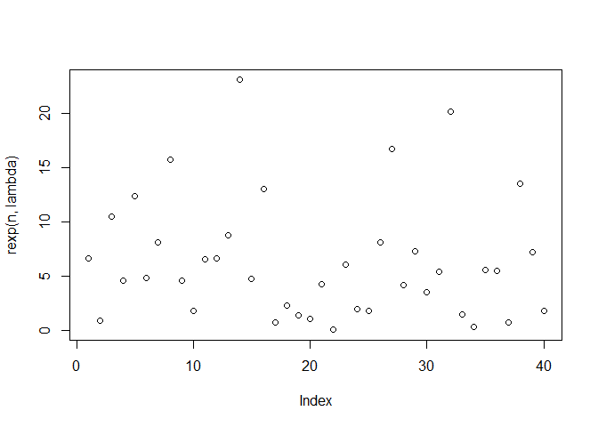
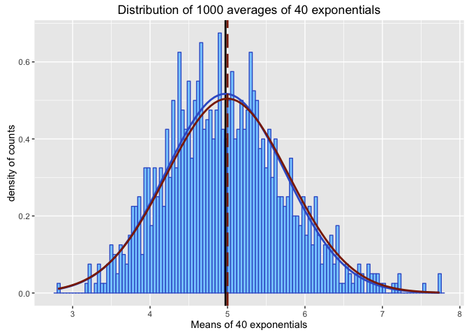

# Statistical Inference - Assignment Part 1: The exponential distribution in R in comparison with the Central Limit Theorem
**authored by [benwol](https://github.com/BenWol/)**

Introduction
------------
In this project you will investigate the exponential distribution in R and compare it with the Central Limit Theorem. The exponential distribution can be simulated in R with rexp(n, lambda) where lambda is the rate parameter. The mean of exponential distribution is 1/lambda and the standard deviation is also 1/lambda. Set lambda = 0.2 for all of the simulations. You will investigate the distribution of averages of 40 exponentials. Note that you will need to do a thousand simulations.

Illustrate via simulation and associated explanatory text the properties of the distribution of the mean of 40 exponentials. You should

1. Show the sample mean and compare it to the theoretical mean of the distribution.
2. Show how variable the sample is (via variance) and compare it to the theoretical variance of the distribution.
3. Show that the distribution is approximately normal.

In point 3, focus on the difference between the distribution of a large collection of random exponentials and the distribution of a large collection of averages of 40 exponentials.


## The exponential function in R
The exponential distribution in R is defined *rexp(n, lambda)* where *n* is the number of observations and *lambda* is the rate parameter. The mean of the distribution is *1/lambda* while the standard deviation is also *1/lambda*.

In the following I will investigate a distribution of averages of 40 exponentials with a rate of *lambda = 0.2*. First I will plot how the 40 exponentials at a rate of 0.2 look like:

```r
lambda <- 0.2
n <- 40
plot(rexp(n,lambda))
```

 

Before answering the 3 questions on the exponential distribution, we will simulate the dataset consisting of 1000 distributions of 40 exponentials as stated in the exercise description. We set a seed in order to be reproducable.


```r
set.seed(1234)
samples <- 1000
data <- matrix(rexp(n*samples,lambda),samples)
tail(data)
```

```
##             [,1]       [,2]      [,3]       [,4]      [,5]      [,6]
## [995,]  4.411600  5.6545015 9.2360993  4.6145086 0.5652748 4.2811795
## [996,]  2.353370  4.2245738 1.7527235 16.1154664 9.9355592 5.6167880
## [997,]  8.042440 37.3082389 0.3933483  1.9403757 6.6380679 0.0919269
## [998,]  2.624388  0.2279896 7.0802497  3.5949721 2.6811151 2.6754854
## [999,]  7.542393  8.5061198 0.1315035  9.1713148 0.6252289 2.0611277
## [1000,] 1.454671  4.8982660 0.4413960  0.6182617 6.7135835 3.7187447
##             [,7]       [,8]        [,9]      [,10]     [,11]     [,12]
## [995,]  2.177573 0.77340361 12.40282567 15.8761334 0.6143829  9.308300
## [996,]  1.048282 6.16663654  4.49918758  0.1876328 6.1969532  2.827769
## [997,]  8.663823 1.57199874  0.02315226  5.2983935 7.3735407  1.533148
## [998,]  1.906929 0.50636029  6.42416179 16.1812797 3.7313775 16.752791
## [999,]  1.863281 1.07701797  2.50217984  0.3206502 8.7622704  9.651810
## [1000,] 2.872878 0.06892261  4.22581889  7.6508107 4.8613578  3.186752
##              [,13]      [,14]     [,15]      [,16]      [,17]     [,18]
## [995,]  11.8852209  0.2971045 2.9503532 11.8230506 16.0349227  2.049766
## [996,]   8.2259164  1.9759970 6.2926030  1.8403186  3.4253089  4.100836
## [997,]   1.9249776  4.0854759 2.3420255  3.1523842  0.1248861  8.216547
## [998,]   0.6444674  2.4386102 0.1324151  0.2375554  1.5753132 11.365578
## [999,]   6.1006161 10.2343989 2.7209340 14.5004732  2.3923089  4.068353
## [1000,] 11.4753004  3.1838802 2.2160382  6.4189836  5.3291779 11.706141
##             [,19]      [,20]    [,21]    [,22]      [,23]     [,24]
## [995,]  17.184438  0.9384184 2.460828 1.198618  0.1290817  1.418727
## [996,]   4.371468 24.9433667 9.885729 5.795012  2.7195020  1.342951
## [997,]   1.761880  0.1842478 1.749539 6.441190  0.4591238  2.491284
## [998,]   2.682315  3.3442294 4.021632 5.612928  7.0384582  2.843030
## [999,]   2.548434  0.1560511 1.110545 3.630792  4.3434488 10.398775
## [1000,]  6.468268  4.2412905 5.669361 8.524247 10.2680061 18.431494
##             [,25]     [,26]     [,27]     [,28]     [,29]     [,30]
## [995,]  10.847277 12.927620 0.6823972 9.1307737  1.850493 16.829347
## [996,]   2.841348  2.459889 4.2360106 6.7580740  1.010571 10.008189
## [997,]   4.276549 13.819028 5.8483997 0.4530531  9.603723  3.929445
## [998,]   3.853813  9.388490 0.2222165 3.7237775 15.408350  5.306724
## [999,]   8.192271 27.246692 8.0816051 1.2826834  9.633015  1.737051
## [1000,]  5.220983  4.114434 2.2698559 0.3447268  1.367204  0.408788
##             [,31]      [,32]      [,33]     [,34]     [,35]      [,36]
## [995,]   3.289012  5.9124922  4.8380060 0.1388911  9.212354 11.4468385
## [996,]   6.162007 11.0437194 13.4318436 1.1705503 25.718109  0.3921350
## [997,]   2.020966  4.6678691  6.4700021 1.5976830 10.041740  0.5582657
## [998,]   0.498876  6.2856636  0.7930051 1.1796224  1.856415  0.4241864
## [999,]  13.153078  8.5609694  7.9239983 7.8605597  6.604618  6.0025332
## [1000,]  2.552353  0.9054635  9.4820584 1.7796118  4.629651  5.2578030
##              [,37]     [,38]     [,39]      [,40]
## [995,]   1.8257287  6.590027  2.952801  0.2585991
## [996,]   0.1336555  2.476772 15.061960  0.9707880
## [997,]  21.6636541  1.958875  7.314758 10.9564226
## [998,]   3.1052502  3.855344  1.678350  0.2233683
## [999,]   4.5288887 14.044861  2.613995  0.4430973
## [1000,] 11.1610368  1.848765  3.855581  4.9428356
```

To double-check, this matrix consists of 1000 rows and 40 colums.


## 1. Sample mean in comparison with the theoretical mean
The mean of ONE distribution of 40 exponentials is e.g.

```r
mean(rexp(n, lambda))
```

```
## [1] 4.076307
```

The theoretical mean is defined as

```r
mean_theory <- 1/lambda
```
and has the value 5.

In order to calculate the sample mean (of 1000 distributions of 40 exponentials), we first calculate the means of single distribution of 40 exponentials, to then calculate the overall mean of the 1000 distribution means.

```r
means_distr <- apply(data,1,mean)
mean_sample <- mean(means_distr)
```

The sample mean is 4.9742388 while the theoretical value is 5, so they differ by 0.5152246 %.

## 2. Sample variance in comparison with the theoretical variance
The standard deviation and variance of ONE distribution of 40 exponentials is e.g.

```r
sd(rexp(n, lambda))
```

```
## [1] 4.203781
```

```r
var(rexp(n, lambda))
```

```
## [1] 21.4481
```

The theoretical variance is defined as

```r
std_theory <- (1/lambda)/sqrt(n)
var_theory <- (std_theory)^2
```
and has the value 0.625.

In order to calculate the sample variance (of 1000 distributions of 40 exponentials), we take all single means of single distribution of 40 exponentials, to then calculate the overall standard deviation of the 1000 distribution standard deviations, and then the sample variance out of that.

```r
std_sample <- sd(means_distr)
var_sample <- var(means_distr)
```
The sample standard deviation is 0.7713431 while the theoretical value is 0.7905694, so they differ by 2.431959 %.
The sample variance is 0.5949702 while the theoretical value is 0.625, so they differ by 4.8047738 %.

## 3. Visualization of the sample distribution of 1000 exponentials of 40
Here we plot a histogramm of the sample distribution and compare it to a Gaussian.

```r
# first I transform the distribution of means of the exponentials into a data.frame for ggplot
df_means_distr <- data.frame(means_distr)

# Main plot
library(ggplot2)
g <- ggplot(df_means_distr, aes(x=means_distr))
g <- g + geom_histogram(binwidth = lambda/5, fill="skyblue1",color="royalblue3",aes(y = ..density..))
g <- g + labs(title = "Distribution of 1000 averages of 40 exponentials", x="Means of 40 exponentials", y="density of counts")
g <- g + geom_vline(xintercept = mean_sample,size = 1.0, color="black")
g <- g + stat_function(fun=dnorm,args=list(mean=mean_sample, sd=std_sample),color = "royalblue3", size = 1.0)
g <- g + geom_vline(xintercept = mean_theory,size= 1.0, color="orangered4",linetype = "longdash")
g <- g + stat_function(fun=dnorm,args=list(mean=mean_theory, sd=std_theory),color = "orangered4", size = 1.0)
g
```

\

The graph shows all calculated data as a summary. In skyblue the main distribution is plotted as a histogramm. In a royalblue line a normal distribution of the histogram is plotted. In red the normal distribution of the theoretical mean and standard deviation is plotted as a comparison. As is obvious, this distribution of 1000 is very Gaussian like, with a slight deviation to lower values than the mean. Also the Mean Values in comparison give this result.

## Summary
These results show that a distribution of 1000 exponentials (of 40) behaves after the Central Limit Theorem and comes close to a Gaussian distribution, in shape, as well as Mean and standard deviation.
