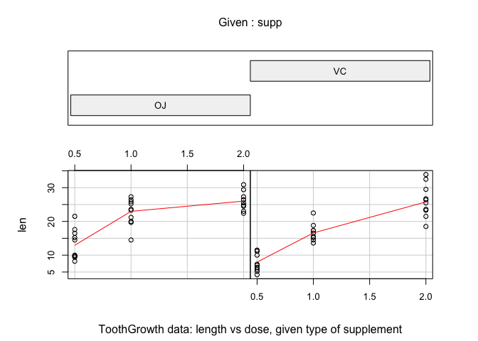

# Statistical Inference - Assignment Part 2: Hypothesis testing on the ToothGrowth dataset in R
**authored by [benwol](https://github.com/BenWol/)**

Introduction
------------
Now in the second portion of the class, we're going to analyze the ToothGrowth data in the R datasets package.

1. Load the ToothGrowth data and perform some basic exploratory data analyses
2. Provide a basic summary of the data.
3. Use confidence intervals and/or hypothesis tests to compare tooth growth by supp and dose. (Only use the techniques from class, even if there's other approaches worth considering)
4. State your conclusions and the assumptions needed for your conclusions.

# The tooth growth dataset in R
First we need to find out what the ToothGrowth dataset is about. Therefore we can call the help funciton:

```r
?ToothGrowth
```
The help article contains the following:

ToothGrowth {datasets}	R Documentation

**The Effect of Vitamin C on Tooth Growth in Guinea Pigs**

*Description:*

The response is the length of odontoblasts (teeth) in each of 10 guinea pigs at each of three dose levels of Vitamin C (0.5, 1, and 2 mg) with each of two delivery methods (orange juice or ascorbic acid).

A data frame with 60 observations on 3 variables.

[,1]	len	numeric	Tooth length

[,2]	supp	factor	Supplement type (VC or OJ).

[,3]	dose	numeric	Dose in milligrams.

Source

C. I. Bliss (1952) The Statistics of Bioassay. Academic Press.

References

McNeil, D. R. (1977) Interactive Data Analysis. New York: Wiley.

## 1. and 2. Load the data and provide a summary.


```r
tg <- ToothGrowth
head(tg)
```

```
##    len supp dose
## 1  4.2   VC  0.5
## 2 11.5   VC  0.5
## 3  7.3   VC  0.5
## 4  5.8   VC  0.5
## 5  6.4   VC  0.5
## 6 10.0   VC  0.5
```

```r
dim(tg)
```

```
## [1] 60  3
```

```r
summary(tg)
```

```
##       len        supp         dose      
##  Min.   : 4.20   OJ:30   Min.   :0.500  
##  1st Qu.:13.07   VC:30   1st Qu.:0.500  
##  Median :19.25           Median :1.000  
##  Mean   :18.81           Mean   :1.167  
##  3rd Qu.:25.27           3rd Qu.:2.000  
##  Max.   :33.90           Max.   :2.000
```


In the help file, this example in terms of the following R code is provided:

```r
require(graphics)
coplot(len ~ dose | supp, data = ToothGrowth, panel = panel.smooth,
       xlab = "ToothGrowth data: length vs dose, given type of supplement")
```

\


So the data contains information about tooth growth rate of 10 guinea pigs from experiments applying 3 dose levels of Vitamin C with 2 delivery types: orange juice (OJ) or absorbic acid (VC). At a first glance, in **both cases the higher dose provides higher growth rate**. Also it looks like that **the OJ method results in a generally higher tooth grow rate** while **the slope of increase with increasing dose is higher with the VC method**. Lets test it a bit.


By comparing the mean values of the tooth growth split by supply method and dose,

```r
mean_supply <- split(tg$len,tg$supp)
sapply(mean_supply,mean)
```

```
##       OJ       VC 
## 20.66333 16.96333
```
and

```r
mean_dose <- split(tg$len,tg$dose)
sapply(mean_dose,mean)
```

```
##    0.5      1      2 
## 10.605 19.735 26.100
```
this behavior is confirmed.


## 3. Hypothesis testing on the ToothGrowth dataset
### Hypothesis A: Tooth growth average difference by supplement type (supp).
We apply a Welch two sample t-test (with the appropriate r formula) on OJ and VC. The null hypothesis would be that there is no difference in supplement type.

```r
t.test(len~supp,data=tg)
```

```
## 
## 	Welch Two Sample t-test
## 
## data:  len by supp
## t = 1.9153, df = 55.309, p-value = 0.06063
## alternative hypothesis: true difference in means is not equal to 0
## 95 percent confidence interval:
##  -0.1710156  7.5710156
## sample estimates:
## mean in group OJ mean in group VC 
##         20.66333         16.96333
```
According to this Hypothesis test the p-value of the null hyphothesis is 6%, and the 95% confidence intervall crosses 0. According to this test, the null hypothesis can not be entirely excluded. Yet it is close.


### Hypothesis B: Tooth growth average difference by dose of 0.5 and 1.
We apply a Welch two sample t-test (with the appropriate r formula) on dose of 0.5 and 1. The null hypothesis would be that there is no difference in the two lower doses.

```r
t.test(len~dose,data=tg[tg$dose == 0.5 | tg$dose == 1.0,])
```

```
## 
## 	Welch Two Sample t-test
## 
## data:  len by dose
## t = -6.4766, df = 37.986, p-value = 1.268e-07
## alternative hypothesis: true difference in means is not equal to 0
## 95 percent confidence interval:
##  -11.983781  -6.276219
## sample estimates:
## mean in group 0.5   mean in group 1 
##            10.605            19.735
```
This test clearly shows that the true difference in means not equal to 0, the p-value of the null hyphothesis is at the 1e-5% level, and the 95% confidence intervall doesn't cross 0. Clearly the higher dose gives a higher average in tooth growth. The null hypothesis is excluded.


### Hypothesis C: Tooth growth average difference by dose of 1 and 2.
We apply a Welch two sample t-test (with the appropriate r formula) on dose of 1 and 2. The null hypothesis would be that there is no difference in the two higher doses.

```r
t.test(len~dose,data=tg[tg$dose == 1.0 | tg$dose == 2.0,])
```

```
## 
## 	Welch Two Sample t-test
## 
## data:  len by dose
## t = -4.9005, df = 37.101, p-value = 1.906e-05
## alternative hypothesis: true difference in means is not equal to 0
## 95 percent confidence interval:
##  -8.996481 -3.733519
## sample estimates:
## mean in group 1 mean in group 2 
##          19.735          26.100
```
Also this test clearly shows that the true difference in means not equal to 0, the p-value of the null hyphothesis is at the 1e-3% level, and the 95% confidence intervall doesn't cross 0. Clearly the higher dose gives a higher average in tooth growth.The null hypothesis is excluded.


### Hypothesis D: Tooth growth average difference by dose of 0.5 and 2.
To double-check we apply a Welch two sample t-test (with the appropriate r formula) on dose of 0.5 and 2. The null hypothesis would be that there is no difference in the two doses.

```r
t.test(len~dose,data=tg[tg$dose == 0.5 | tg$dose == 2.0,])
```

```
## 
## 	Welch Two Sample t-test
## 
## data:  len by dose
## t = -11.799, df = 36.883, p-value = 4.398e-14
## alternative hypothesis: true difference in means is not equal to 0
## 95 percent confidence interval:
##  -18.15617 -12.83383
## sample estimates:
## mean in group 0.5   mean in group 2 
##            10.605            26.100
```
And finally this test clearly shows that the true difference in means not equal to 0, the p-value of the null hyphothesis is at the 1e-12% level, and the 95% confidence intervall doesn't cross 0. Clearly the higher dose gives a higher average in tooth growth. The null hypothesis is excluded.

## 4. Conclusions
To conclude, only in the exploratory analysis it is reveled that the orange juice (OJ) supply method leads to a higher tooth growth rate than the ascorbic acid method (VC). The null hypothesis on a difference between both cannot fully be excluded.

On the dose side, it can be clearly shown that the differently increasing Vitamin C doses all increase the tooth length of the guinea pigs.

Thanks for reading, and don't forget to brush your teeth every day (twice!) ;)
