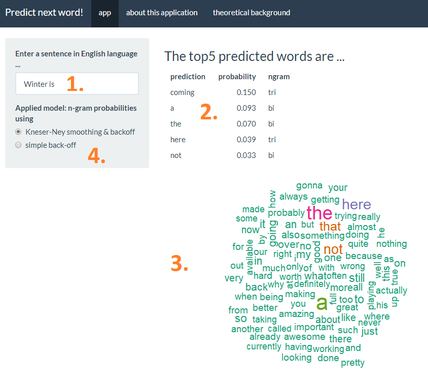

# Coursera Data Science Specialization - Capstone Project

This application was created as part of the capstone project for the [Coursera Data Science Specialization](https://www.coursera.org/specializations/jhu-data-science) offered by professors Jeff Leek, Roger D. Peng and Brian Caffo of the BLoomberg School of Public Health at Johns Hopkins Universtity, Baltimore, USA, in cooperation with [SwiftKey](https://swiftkey.com).

Around the world, people are spending an increasing amount of time on their mobile devices for email, social networking, banking and a whole range of other activities. But typing on mobile devices can be a serious pain. SwiftKey, our corporate partner in this capstone, builds a smart keyboard that makes it easier for people to type on their mobile devices. One cornerstone of their smart keyboard is predictive text models.

## Objective

The main goal behind the capstone project was to built an application that is able to predict the next word given a sequence of input words. The [training data](https://d396qusza40orc.cloudfront.net/dsscapstone/dataset/Coursera-SwiftKey.zip) for this task was provided by SwiftKey and contains accumulated text data of english tweets, news and blog entries. All data wrangling, exploratory analysis, predictive modeling and the creation of the web application were done with a variety of R packages.

## Approach

All lines of text were cleaned by conversion to lowercase, removal of punctuation and whitespace, links, numbers and special characters. Afterwards, the "clean" sentences were tokenized into different orders of [ngrams](https://en.wikipedia.org/wiki/N-gram) which are sequences of n words, i.e. unigrams being 1 word, bigrams being two consecutive words, trigrams being three consecutive words, etc.

Afterwards, the probability of the individual uni-, bi-, tri- and fourgrams as a function of all ngrams in the word corpus was calculated. By applying different probability models (see the "theoretical background" tab), the most probable next word of an input sequence is calculated. Generally, a probablility distribution of an entire corpus can be calculated via a maximum likelihood estimate (MLE), hence the probability of an n-gram being the number of times it appears divided by the number of all n-grams. Here, problems can arise when the n-gram of choice was not seen before in the data yielding a MLE of 0. A workaround are smoothing techniques, with the [Kneser-Ney smoothing](https://en.wikipedia.org/wiki/Kneser%E2%80%93Ney_smoothing) being the most effective for our problem. The application returns the Top5 most probable next words, plus visualizes the Top50 most probable words in a word cloud. In our app, the output of next word predictions can be calculated with either the "Kneser-Ney Smoothing" or simple backoff MLEs.

## Use of the application

The application holds the text "Winter is" (as homage to Game of Thrones) as a default in the input text field [1.]. Here, any English sentences can be given as an input. Immediately after the input sequence is finished, the application renders the Top5 most probable words that are expected after the given input sequence [2.]. Moreover, the respective probabilites are prompted plus the information whether the information results from a four-, tri-, bi- or unigram. In case of the default input, the word "coming" is calculated with a relative probability of 15%. Additionally, the Top50 resulting next words are visualized in form of a word cloud [3.]. A technical gimmick is given by the choice of model [4.] being either a simple backoff model or a more advanced model using Kneser-Ney smoothing (see the theoretical background tab).

