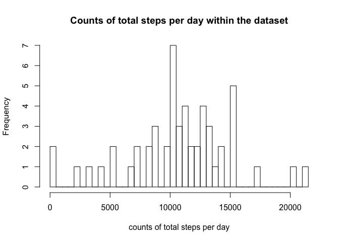
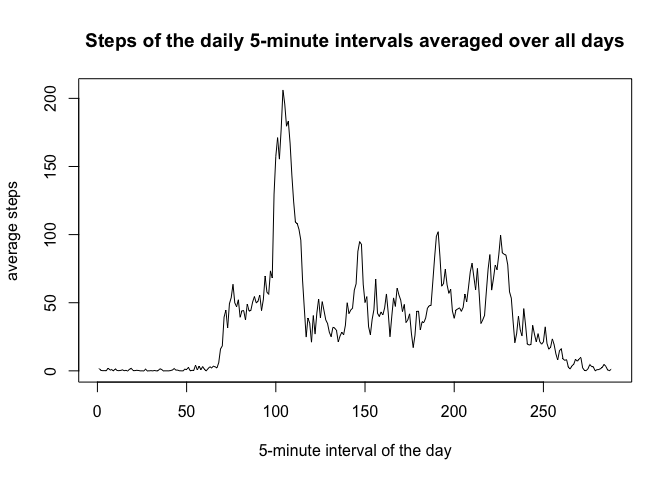
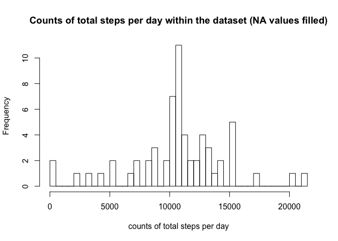
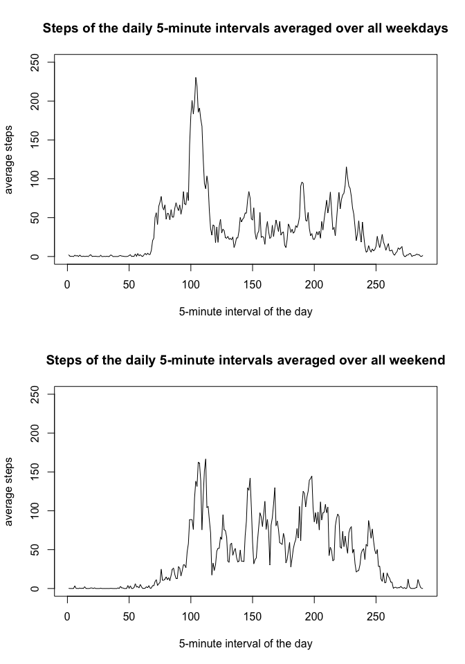

# Reproducible Research: Peer Assessment 1
**authored by [benwol](https://github.com/BenWol/RepData_PeerAssessment1)**

Introduction
------------
It is now possible to collect a large amount of data about personal movement using activity monitoring devices such as a Fitbit, Nike Fuelband, or Jawbone Up. These type of devices are part of the “quantified self” movement – a group of enthusiasts who take measurements about themselves regularly to improve their health, to find patterns in their behavior, or because they are tech geeks. But these data remain under-utilized both because the raw data are hard to obtain and there is a lack of statistical methods and software for processing and interpreting the data.

This assignment makes use of data from a personal activity monitoring device. This device collects data at 5 minute intervals through out the day. The data consists of two months of data from an anonymous individual collected during the months of October and November, 2012 and include the number of steps taken in 5 minute intervals each day.

## Loading and preprocessing the data
The activity data set should be provided in the forked github repository "RepData_PeerAssessment1" as a zip file. If that is not the case, it can be downloaded from the course web site. Then it needs to be unzipped to a csv-file. The following piece of code checks if both steps have been realized and if not performs both actions:  

```r
if(!file.exists("activity.zip")){
        url <- "https://d396qusza40orc.cloudfront.net/repdata%2Fdata%2Factivity.zip"
        download.file(url,destfile = "activity.zip",method = "curl")
}

if(!file.exists("activity.csv")){
        unzip("activity.zip")
}
```
 
The data is loaded as follows

```r
act <- read.csv("activity.csv")
```

and contains 17568 observations (rows) and includes 3 variables (colums). The variables names are steps, date, interval and signify

* **steps**: Number of steps taking in a 5-minute interval (missing values are coded as NA)
* **date**: The date on which the measurement was taken in YYYY-MM-DD format
* **interval**: Identifier for the 5-minute interval in which measurement was taken

For convenience the dataset in later-on analyses, the dataset is converted to the data.table format and the date variable is set as dates instead of factors:

```r
library("data.table")
act <- data.table(act)
act$date <- as.Date(act$date)
```
Here is an extract of the dataset:

```r
act
```

```
##        steps       date interval
##     1:    NA 2012-10-01        0
##     2:    NA 2012-10-01        5
##     3:    NA 2012-10-01       10
##     4:    NA 2012-10-01       15
##     5:    NA 2012-10-01       20
##    ---                          
## 17564:    NA 2012-11-30     2335
## 17565:    NA 2012-11-30     2340
## 17566:    NA 2012-11-30     2345
## 17567:    NA 2012-11-30     2350
## 17568:    NA 2012-11-30     2355
```
## What is mean total number of steps taken per day?
For this part of the assignment the missing values in the dataset (NAs) are ignored, hence emitted from the dataset.

```r
act_noNA <- act[!is.na(act$steps),]
```

The original dataset holds 2304 missing values. By looking at the dataset, you can see that always complete days show missing values. To double-check that, I divide the total number of missing values by the number of 5-minute intervals per day (60*24/5=288):

```r
sum(is.na(act$steps))/(60*24/5)
```

```
## [1] 8
```
The missing values correspond to 8 days.

Next, a histogram of the total number of steps taken PER day (NA values ignored) is created. 

```r
tsteps_per_day <- act_noNA[,sum(steps),by=date]
colnames(tsteps_per_day) <- c("date","totalSteps")
hist(tsteps_per_day$totalSteps,breaks = 50,main="Counts of total steps per day within the dataset",xlab = "counts of total steps per day")
```

\
The mean and the median total number of steps taken per day is calculated in the following.

```r
mean(tsteps_per_day$totalSteps,na.rm = TRUE)
```

```
## [1] 10766.19
```

```r
median(tsteps_per_day$totalSteps,na.rm = TRUE)
```

```
## [1] 10765
```
The mean is marginally bigger than the median.

## What is the average daily activity pattern?
Next, I want to know how many steps throughout the day (in 5min intervals) the participant made, averaged over all 53 days within october and november of 2012, where his/her steps where detected (without NA values).

Therefore I calculate the average number of steps taken per 5min interval, averages across all days (y-axis) and make a time series plot (line plot):

```r
avg_daily_pattern <- act_noNA[,mean(steps),by=interval]
colnames(avg_daily_pattern) <- c("interval","averageNumberOfSteps")
plot(avg_daily_pattern$averageNumberOfSteps,type = "l",main="Steps of the daily 5-minute intervals averaged over all days", xlab = "5-minute interval of the day", ylab = "average steps")
```

\
**The x axis contains 288 points which correspond to all 5-minute intervals of one day!!!**

The 5-minute interval, on average across all the days in the dataset, that contains the maximum number of steps is:

```r
avg_daily_pattern[avg_daily_pattern$averageNumberOfSteps == max(avg_daily_pattern$averageNumberOfSteps),]$interval
```

```
## [1] 835
```

So the 5-minute interval with the maximum avergage step number starts at 8:35 am.

## Imputing missing values
Since there are a number of days/intervals where there are missing values (coded as NA), the presence of missing days may introduce bias into some calculations or summaries of the data. In the following I want to induce a strategy to fill the NA values, to then see how our resutls so far change.

The total number of missing values in the dataset (i.e. the total number of rows with NAs) is

```r
sum(is.na(act$steps))
```

```
## [1] 2304
```

**Strategy to fill the NAs:**
As a strategy I choose to *fill the NA values with the average step value for the corresponding 5-minute interval*. It seems to me that this will NOT influence the outcome of our previous investigations. Another option would be to use the mean/median of the day an NA occurs, yet it was found earlier, that the NA values always correspond to full days, so this cannot work.

Here I create a new dataset named 'act_fillNA' that is equal to the original dataset 'act' but with the missing values filled in by the average step value per 5-minute interval.

```r
act_fillNA <- act
for(i in 1:nrow(act_fillNA)){
        if (is.na(act_fillNA$steps[i])) {
                tmp_interval <- act_fillNA[i,interval]
                act_fillNA$steps[i] <- avg_daily_pattern[avg_daily_pattern$interval == act_fillNA[i,interval],]$averageNumberOfSteps
        }
}
```
To double-check if it was successful, I check the number of NA values in the new dataset:

```r
sum(is.na(act_fillNA$steps))
```

```
## [1] 0
```
It should have worked because there are 0 NA values.

Now the histogram of the total number of steps taken PER day is created again with the new dataset with filled in NA values.

```r
tsteps_per_day_fillNA <- act_fillNA[,sum(steps),by=date]
colnames(tsteps_per_day_fillNA) <- c("date","totalSteps")
hist(tsteps_per_day_fillNA$totalSteps,breaks = 50,main="Counts of total steps per day within the dataset (NA values filled)",xlab = "counts of total steps per day")
```

\
The mean and the median total number of steps taken per day is calculated in the following.

```r
mean(tsteps_per_day_fillNA$totalSteps,na.rm = TRUE)
```

```
## [1] 10766.19
```

```r
median(tsteps_per_day_fillNA$totalSteps,na.rm = TRUE)
```

```
## [1] 10766.19
```
Do these values differ from the estimates from the first part of the assignment?

```r
mean(tsteps_per_day_fillNA$totalSteps,na.rm = TRUE) == median(tsteps_per_day_fillNA$totalSteps,na.rm = TRUE)
```

```
## [1] TRUE
```

```r
mean(tsteps_per_day_fillNA$totalSteps,na.rm = TRUE) == mean(tsteps_per_day$totalSteps,na.rm = TRUE)
```

```
## [1] TRUE
```

```r
median(tsteps_per_day_fillNA$totalSteps,na.rm = TRUE) == median(tsteps_per_day$totalSteps,na.rm = TRUE)
```

```
## [1] FALSE
```
After filling the NA values, the mean and the median value of the total number of steps taken per day are equal now. Compared to the first part of the assignment, the mean value stayed the same, while logically the median slightly increased to the mean value.

The impact of imputing NA values with the average value of steps per 5-minute interval is NOT VERY BIG, which is good to not have a distortion of the results after replacing missing values. So the mean value does not change at all, and the overall distribution of values moves more towards the mean value. Obviously the overall frequency of the results is higher since we have more values now.

## Are there differences in activity patterns between weekdays and weekends?
To answer this question, the dates need to be ordered after whether they are a weekday or belong to the weekend. Therefore I create a category variable and at it to the new dataset where the NA values were filled.

```r
library(dplyr)
act_fillNA <- mutate(act_fillNA, DayOfWeek = factor(1 * (weekdays(act$date) %in% c("Saturday","Sunday")),labels = c("weekday","weekend") ))
table(act_fillNA$DayOfWeek)
```

```
## 
## weekday weekend 
##   12960    4608
```
As you can see the ratio between weekend days and weekdays of 35.5555556% is about right.

Now we need to calculate according to earlier, the average number of steps per 5-minute interval, yet this time not for all days but separated in weekdays and weekend days. The result is plotted for comparison and scaled similarly on both axes.

```r
avg_daily_pattern_weekdays <- act_fillNA[,mean(steps),by=list(interval,DayOfWeek)]
colnames(avg_daily_pattern_weekdays) <- c("interval","DayOfWeek","averageNumberOfSteps")
par(mfrow = c(2, 1))
plot(avg_daily_pattern_weekdays[avg_daily_pattern_weekdays$DayOfWeek=="weekday",]$averageNumberOfSteps,type = "l",main="Steps of the daily 5-minute intervals averaged over all weekdays", xlab = "5-minute interval of the day", ylab = "average steps",ylim=c(0, 250))
plot(avg_daily_pattern_weekdays[avg_daily_pattern_weekdays$DayOfWeek=="weekend",]$averageNumberOfSteps,type = "l",main="Steps of the daily 5-minute intervals averaged over all weekend", xlab = "5-minute interval of the day", ylab = "average steps", ylim=c(0,250))
```

\
**Again the x axes contains 288 points which correspond to all 5-minute intervals of one day!!!**

What is striking, is that the weekdays show a strong peak around 8:30 AM and then smaller peaks throughout the day. On the other side, on the weekend, there are smaller peaks (slightly higher in average then during the week) throughout all the day, with no striking local maximum. To interpret this, I would say the participant get up earlier during the week and maybe on his way to work walks a lot. Then at work he walks not so much anymore. On the weekend he gets up a little later, and is slightly more active yet doesn't have the hustle to get to work.
